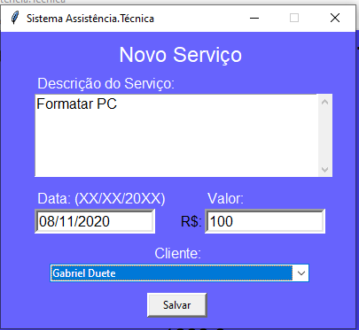
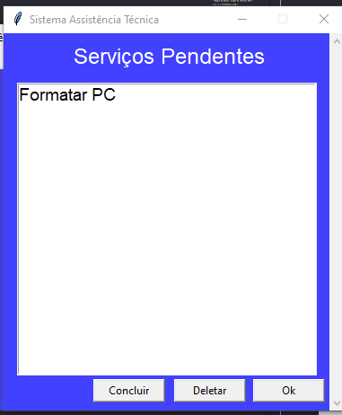
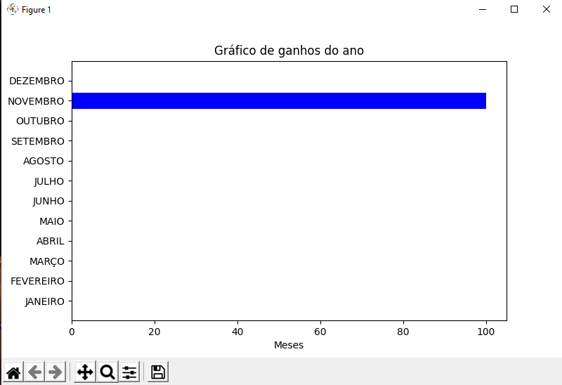
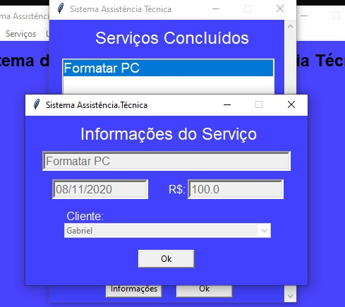
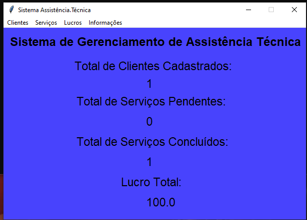
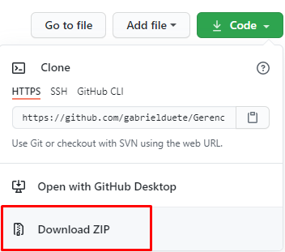
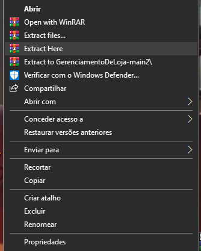
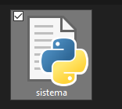

<h1 align ='center'> Sistema Gerenciamento de Assistência Técnica</h1>
 

# ⏩ Preview
- Cadastro de Clientes
- Tela de novo serviço/Serviços Pendentes

- Gráfico de lucro do ano

- Tela de serviços Concluidos

- Tela Principal

# 📝Esse sistema auxilia na organização e gerência de sua loja.<h3>

- Recebe e armazena os dados dos clientes.
- Recebe o serviço proposto para cada cliente.
- Gera um gráfico que mostra o lucro obtido em cada mês.
- Telas de serviços pendentes/concluidos.

# 💻 Tecnologias Usadas

- [python] (https://www.python.org/)

# ▶ Como usar

- Para executar, é necessário o python-3.7+

- Faça o download ZIP

- Depois de baixar, Clique em "Extract Here"

- Execute o arquivo 'sistema'

